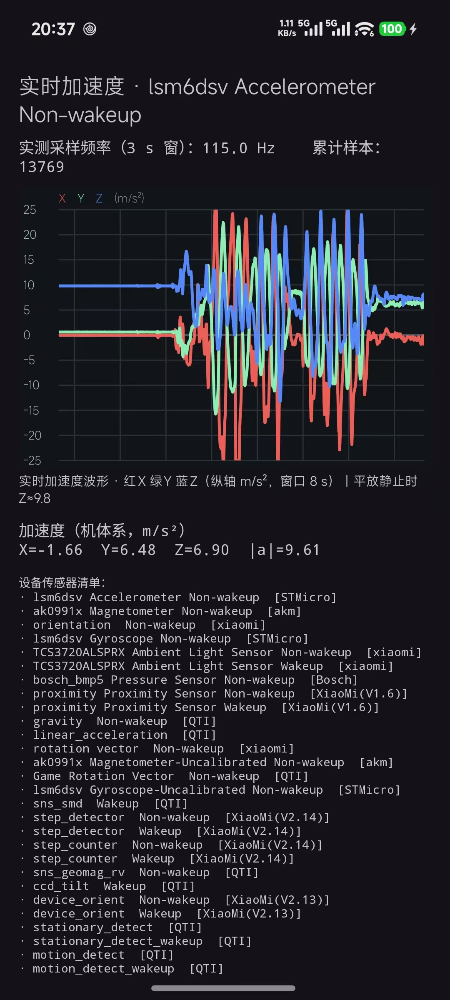

# SensorLog · 多元感知融合 · 传感器

一个用于「多元感知融合」课程的工程：Android 端负责**稳定采集原始传感器数据并打标签**，
PC 端 Python 工程负责**质量检查、滑窗、时域特征、频域特征、失效实验与报告**。

- 实时显示加速度 X/Y/Z **滚动波形**与实测采样频率
- 一键**同步采集**加速度计 + 陀螺仪，写出 CSV + `metadata.json` + `labels.csv`
- 采集前配置路线、手机位置、朝向、备注与目标时长（默认 1200 s）
- 采集中实时显示已采集时长 / 是否达标 / 样本数 / 打点次数，支持事件打点
- 新增 Python 特征工程分析工程：质量检查、滑窗、手写时域四件套、FFT 主峰步频、D06/D07 与公交防误计步

---

## 功能特性

### 1. 实时加速度波形与采样频率（`MainActivity`）

- 以 `SENSOR_DELAY_GAME` 档位注册传感器，`onPause()` 中注销并停止采集，避免后台耗电。
- 自定义 `WaveformView` 绘制三通道曲线，红 X / 绿 Y / 蓝 Z，纵轴 `m/s²`，默认窗口 8 s。
- 顶部实时显示**实测采样频率**（3 s 滑动窗口）与累计回调数。

### 2. 双传感器同步原始采集（`SensorSessionRecorder`）

- 同一次会话中同时注册加速度计与陀螺仪，共用系统启动时钟。
- 每次 `onSensorChanged()` 都保留**原始 `SensorEvent.timestamp`**（纳秒），不做格式化替代。
- 采集阶段**不做**滤波、插值、坐标旋转、单位换算或降采样，保证原始数据可追溯。
- 每次采集创建独立会话目录；停止时 `flush`、关闭文件并写入 `completed` 元数据。
- 采集期间页面保持常亮；进入后台会安全停止并落盘。

### 3. 采集配置与事件打点

- 开始前填写/选择：路线名称、手机位置、手机朝向、备注、目标时长。
- `metadata.json` 记录 `experiment`、`app_version`、`route_name`、`device_placement`、
  `orientation`、`target_duration_seconds`、`note`、`labels`。
- `labels.csv` 表头 `timestamp_elapsed_ns,wall_time_epoch_ms,label`，支持预设标签
  （上车 / 下车 / 开始步行 / 进入电梯 / 到达等）与自定义标签，打点后保留输入内容。

### 4. Python 特征工程分析（`analysis/`）

- 质量检查：时间戳单调性、重复/回退、间隔分位数、长间断、单位量级、标签映射。
- 滑动窗口：窗长 / 步进 / 重叠率可配置，输出窗口级索引与状态标签。
- 手写时域四件套：均值、总体方差、过零率、动态峰值（三轴 + 合矢量）。
- FFT：去直流 + 汉宁窗，单边频谱主峰 → 步频 `f_peak × 60`。
- D06 窗长/步进参数实验场、D07 混叠实验、公交防误计步两个特征。

---

## 截图

| 实时波形 + 双传感器采集 |
|:---:|
|  |

> 真机实测：加速度计约 `115 Hz`、陀螺仪约 `46 Hz`（`SENSOR_DELAY_GAME` 档位下的实测值）。

---

## 采集数据

数据写入应用外部私有目录（无需存储权限）：

```
/sdcard/Android/data/com.example.sensorlog/files/sensor-sessions/<会话ID>/
├── accelerometer.csv     # timestamp_ns,x_m_s2,y_m_s2,z_m_s2
├── gyroscope.csv         # timestamp_ns,x_rad_s,y_rad_s,z_rad_s
├── labels.csv            # timestamp_elapsed_ns,wall_time_epoch_ms,label
└── metadata.json         # 设备/传感器/采集配置/样本统计/完成状态
```

- 单位与坐标：加速度 `m/s²`、角速度 `rad/s`，均为 **Android 设备机体系 X/Y/Z**。
- 时间戳：`SensorEvent.timestamp`，单位纳秒，单调递增，可换算为实测采样频率。
- 导出：`adb pull /sdcard/Android/data/com.example.sensorlog/files/sensor-sessions/ <本地目录>`

### 20 分钟采集协议

1. 确定一条约 20 分钟的连续路线，尽量包含步行 + 乘车 + 静止/电梯等状态；
2. 采集前填写路线名称、手机位置（兜里/手持/腰包/车内支架）和朝向，保持全程不变；
3. 点击开始后先静止 1～2 分钟，再连续步行 3～5 分钟；
4. 途中包含一段乘车或校园车数据用于公交防误计步，随后再次步行 3～5 分钟；
5. 全程保持页面在前台、不熄屏、不切换应用，关键状态用“打点”按钮记录；
6. 停止后检查 `accelerometer.csv`、`gyroscope.csv`、`metadata.json`、`labels.csv` 是否完整。

---

## Python 分析工程

```bash
cd analysis
python -m venv .venv
.venv\Scripts\activate                 # Windows；Linux/macOS 用 source .venv/bin/activate
pip install -e ".[dev]"
pytest                                 # 运行单元测试

# 仓库根目录执行一键分析
python -m sensor_analysis.pipeline --session data/task3/raw \
    --out analysis_outputs/20261008_195431_052 --window 4 --step 2
```

输出目录结构：

```text
analysis_outputs/<session_id>/
├── quality_report.json
├── labels_resolved.csv
├── windows.csv
├── window_features.csv
├── window_frequency_features.csv
├── spectrum.npz
├── d06_summary.json / d06_window_sweep.csv / d06_event_split.csv
├── d07_summary.json
├── bus_summary.json
├── report.md
└── figures/
    ├── waveform.png / time_features.png / fft_spectrum.png / time_frequency.png
    ├── d06_window_sweep.png / d07_alias.png / bus_features.png
```

详见 [分析工程说明](analysis/README.md) 与 [第 2 课时实验报告](docs/experiment2-report.md)。

---

## 构建与运行

### 环境要求

| 项目 | 版本 |
|---|---|
| JDK | 25（Gradle toolchain，由 foojay resolver 自动拉取） |
| Gradle | 9.6.0（随 wrapper） |
| Android Gradle Plugin | 9.4.1 |
| compileSdk / targetSdk | 37 |
| minSdk | 24（Android 7.0） |

```bash
# Debug 构建 + 单元测试
./gradlew testDebugUnitTest assembleDebug      # Windows: .\gradlew.bat ...
```

产物：`app/build/outputs/apk/debug/app-debug.apk`

---

## 项目结构

```
Sensor/
├── app/src/main/java/com/example/sensorlog/
│   ├── MainActivity.kt            # 实时波形 + 采集配置 + 事件打点
│   ├── SensorSessionRecorder.kt   # 双传感器原始数据 + labels.csv 落盘
│   └── WaveformView.kt            # 自定义波形控件
├── analysis/                      # Python 特征工程分析工程
│   ├── pyproject.toml
│   ├── README.md
│   ├── src/sensor_analysis/
│   └── tests/
├── analysis_outputs/              # 分析结果、图表与自动报告
├── data/                          # 原始数据与整理数据
├── docs/                          # 任务清单、验证报告、实验报告与证据
│   ├── tasks.md / tasks2.md / tasks-code-reflash.md
│   ├── experiment2-report.md
│   └── evidence/
└── README.md
```

---

## 技术栈

Kotlin · AndroidX（AppCompat / ConstraintLayout / Activity KTX）· Material Components · ViewBinding ·
Gradle Version Catalog · Python（numpy / pandas / matplotlib / scipy / pytest）

---

## 相关文档

- [第 2 课时任务清单](docs/tasks2.md)
- [工程代码刷新任务清单](docs/tasks-code-reflash.md)
- [第 2 课时特征工程实验报告](docs/experiment2-report.md)
- [任务 2 验证报告（实测采样频率）](docs/task2-verification.md)

---

## 说明

本项目为北京邮电大学软件工程专业《多元感知融合》课程第 2 节课后任务实现，
`docs/` 目录保留任务过程与真机验证证据，便于对照验收标准。
