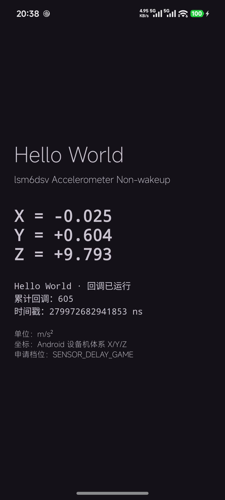

# SensorLog · 多元感知融合 · 传感器

一个用于「传感器基本原理与 Android 调用」课程的 Android 示例工程：把 `SensorManager` →
`Sensor` → `SensorEventListener` 这条链路跑通，并把加速度计与陀螺仪的**原始采样**同步落盘为可追溯的数据。

- 实时显示加速度 X/Y/Z **滚动波形**
- 显示**实测采样频率**（而非申请档位）与累计回调数
- 一键**同步采集**加速度计 + 陀螺仪，写出 CSV + `metadata.json`
- 附一个「二十行请出传感器数据」的最小可运行示例 `HelloWorldActivity`

---

## 功能特性

### 1. 实时加速度波形（`MainActivity`）

- 以 `SENSOR_DELAY_GAME` 档位注册加速度计，`onPause()` 中注销，避免后台耗电。
- 自定义 `WaveformView` 绘制三通道曲线，红光 X / 绿 Y / 蓝 Z，纵轴 `m/s²`，默认窗口 8 s。
- 顶部实时显示**实测采样频率**（3 s 滑动窗口统计回调到达时间）与累计回调数。
- 平放静止时 Z ≈ 9.8，可据此快速判断数据是否符合物理预期。

### 2. 双传感器同步原始采集（`SensorSessionRecorder`）

- 同一次会话中同时注册加速度计与陀螺仪，共用采样时间基准。
- 每次 `onSensorChanged()` 都保留**原始 `SensorEvent.timestamp`**（纳秒），不做格式化替代。
- 采集阶段**不做**滤波、插值、坐标旋转、单位换算或降采样，保证原始数据可追溯。
- 每次采集创建独立会话目录（目录名含日期时间），停止时 `flush`、关闭文件并写入元数据。
- 页面保持常亮，保证长时采集不中断。

### 3. 最小示例（`HelloWorldActivity`）

课件「二十行，请出传感器数据」的最小实现，只做一件事：把加速度计的 X/Y/Z 实时打在屏幕上，并显示传感器型号、累计回调数与原始时间戳。

---

## 截图

| 实时波形 + 双传感器采集 | Hello World 最小示例 |
|:---:|:---:|
|  |  |

> 真机实测：加速度计约 `115 Hz`、陀螺仪约 `46 Hz`（`SENSOR_DELAY_GAME` 档位下的实测值）。

---

## 采集数据

数据写入应用外部私有目录（无需存储权限）：

```
/sdcard/Android/data/com.example.sensorlog/files/sensor-sessions/<会话ID>/
├── accelerometer.csv     # timestamp_ns,x_m_s2,y_m_s2,z_m_s2
├── gyroscope.csv         # timestamp_ns,x_rad_s,y_rad_s,z_rad_s
└── metadata.json         # 设备/传感器参数、采集时间、完成状态
```

- 单位与坐标：加速度 `m/s²`、角速度 `rad/s`，均为 **Android 设备机体系 X/Y/Z**。
- 时间戳：`SensorEvent.timestamp`，单位纳秒，单调递增，可换算为实测采样频率。
- 导出：`adb pull /sdcard/Android/data/com.example.sensorlog/files/sensor-sessions/ <本地目录>`

---

## 构建与运行

### 环境要求

| 项目 | 版本 |
|---|---|
| JDK | 25（Gradle toolchain，由 foojay resolver 自动拉取） |
| Gradle | 9.6.0（随 wrapper） |
| Android Gradle Plugin | 9.4.1 |
| compileSdk / targetSdk | 37 |
| minSdk | 24（Android 7.0） |

### 步骤

```bash
git clone https://github.com/FeonzmEko/Sensor.git
cd Sensor

# Debug 构建 + 单元测试
./gradlew testDebugUnitTest assembleDebug      # Windows: .\gradlew.bat ...
```

产物：`app/build/outputs/apk/debug/app-debug.apk`

也可以直接用 Android Studio 打开**仓库根目录**（含 `settings.gradle.kts` 的这层），等待 Gradle Sync 后点运行。

> 真机测试更贴近真实传感器数据；模拟器传感器为软件模拟，频率与噪声特征不具备参考价值。

---

## 项目结构

```
Sensor/
├── app/src/main/java/com/example/sensorlog/
│   ├── MainActivity.kt            # 实时波形 + 采集入口
│   ├── SensorSessionRecorder.kt   # 双传感器原始数据落盘
│   ├── WaveformView.kt            # 自定义波形控件
│   └── HelloWorldActivity.kt      # 最小监听取值示例
├── app/src/main/res/              # 布局、主题、字符串等资源
├── docs/                          # 任务清单、验证报告与真机证据
│   ├── tasks.md
│   ├── task2-verification.md
│   ├── task3-short-test.md
│   └── evidence/
├── gradle/libs.versions.toml      # 依赖版本集中管理
└── settings.gradle.kts
```

---

## 技术栈

Kotlin · AndroidX（AppCompat / ConstraintLayout / Activity KTX）· Material Components · ViewBinding ·
Gradle Version Catalog

---

## 相关文档

- [课后任务清单](docs/tasks.md)
- [任务 2 验证报告（实测采样频率）](docs/task2-verification.md)
- [任务 3 双传感器短测记录](docs/task3-short-test.md)

---

## 说明

本项目为北京邮电大学软件工程专业《多元感知融合》课程第 2 节课后任务实现，
`docs/` 目录保留了任务过程与真机验证证据，便于对照验收标准。